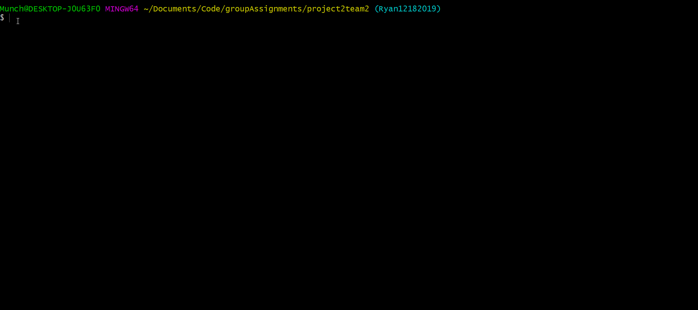
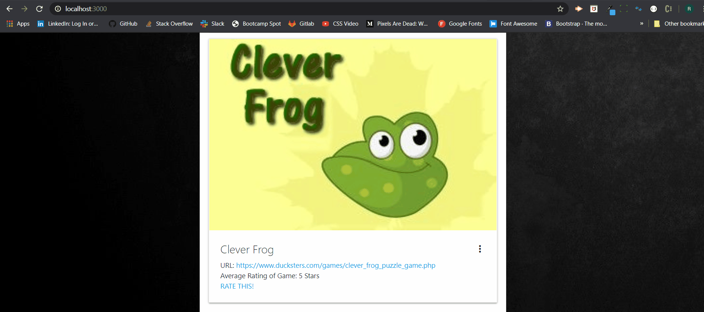

# Prodigies

This app has been created to provide entertaining and educational games to children in a space where they can easily access them all from one spot. Any user is allowed to add games to the preexisting list at any time. They may also rate them out of 5 stars to remember how much they enjoyed it and share their review with others via contributing to a community average rating.

## Prerequisites to Run Locally

If you intend to run this app locally, you will need to install all of the dependencies it requires. You can find that list within config/config.json. Navigate to your terminal of choice and in the root directory run 'npm install" and your dependencies will be installed locally.

Next you will navigate to the root file of the app and run "node server.js" which will get the server connection running.

## Viewing the Prodigies App

Now for the best part, navigate to your browser, preferably Chrome and into the Omnibox type: "localhost:3000". This will bring you to the Prodigies homepage which will display a list of educational games as you scroll down the page. 

Each game below it's image will have:
* A url to access it
* The average rating from all users who previously gave their rating (which is based out of 5 total stars).
* A link to rate the game

If you haven't yet added your own rating, click the "RATE THIS!" hyperlink. Once you're on the next page, scroll down in order to click the amount of stars out of 5 you'd rate the game as well as leave a comment about what you think, and how much you LOVE Prodigies.

## Usage

This project was built using HTML, CSS, Materialize JS, jQuery, handlebars, MySQL, Sequelize, Three.js, and Socket.IO.

## Contributing

## License

This project is credited to and created by kima111, ajperkins92, patrickschroedl, & Munchinator6354. Check out their GitHub pages!

Bye for now!

